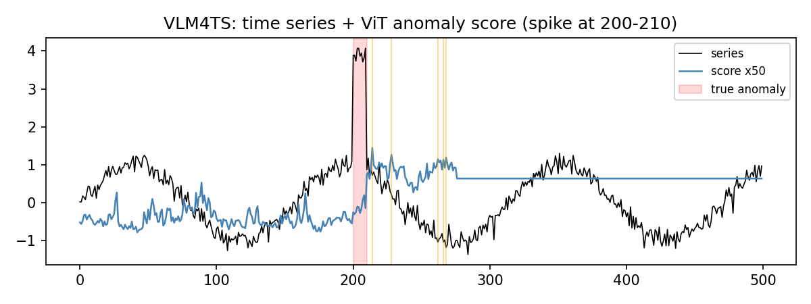

# VLM4TS: Vision-Language Time-Series Anomaly Screening

> Independent Python prototype inspired by He et al.,
> [“Harnessing Vision-Language Models for Time Series Anomaly Detection”](https://arxiv.org/abs/2506.06836)
> (AAAI 2026 Oral).
> Python 3.11 · CPU only · CLIP ViT-B/32 · optional `gpt-4o-mini` · Streamlit.

Each sliding window becomes a line-plot image and a normalized CLIP embedding:

```python
score = 1 - cosine(window_embedding, median_embedding)
```

High-score windows become anomaly candidates. An optional VLM call receives one
full-series image and returns a keep/drop mask for those candidates.

> **Disclaimer:** This is an independent educational implementation. It is not
> affiliated with, endorsed by, or maintained by the paper's authors, their
> institutions, AAAI, or the upstream VLM4TS team. It does not reproduce the
> paper's reported results.

---

## Install (uv)

```bash
uv sync --python 3.11
uv sync --extra dev
```

The first scoring run downloads and caches the OpenAI CLIP checkpoint from
Hugging Face. Later runs reuse that cache.

## Streamlit app

```bash
uv run streamlit run app.py
```

Upload a CSV containing a numeric `value` column, or any CSV whose first column
contains finite numbers. The app renders the series, shows screening candidates,
and can optionally ask `gpt-4o-mini` to refine them.

## Synthetic demo (not benchmark reproduction)

```bash
uv run python -m vlm4ts.vit4ts --demo
# demo: evaluated scores=33, candidates=1

uv run python scripts/bench.py
# synthetic smoke: evaluated_scores=33 candidates=1
```



*Illustrative synthetic output, not an evaluation result.*

The demo checks finite scores and candidate generation. The benchmark script is
only a synthetic runtime smoke test: neither command evaluates a public dataset
or substantiates a performance claim.

## Implemented scope

- Sliding 224-sample windows rendered as RGB line plots.
- Normalized OpenAI CLIP ViT-B/32 image embeddings.
- Cosine distance from the median window embedding.
- Top-alpha candidate selection over finite, non-constant scores.
- Optional `gpt-4o-mini` keep/drop refinement in one API call.
- Streamlit CSV upload, visualization, and candidate display.

The paper uses ViT-B/16, patch-level multi-scale cross-patch scoring, shared
global y-limits, GPT-4o, and 11 NAB/NASA/YAHOO benchmark datasets. Those methods
and benchmark reproductions are outside this release's scope.

## Data and optional VLM

Without `OPENAI_API_KEY`, candidates are returned unchanged. When VLM refinement
is enabled, the rendered uploaded series is sent to OpenAI and may incur API
costs. Do not include secrets in uploaded data. See OpenAI's
[data controls documentation](https://developers.openai.com/api/docs/guides/your-data).

Use this repository's Forgejo issues for questions and non-sensitive bug reports.
Report vulnerabilities privately to `zoonyanapat@gmail.com`; do not post exploit
details publicly.

## Verification

```bash
uv lock --check && uv sync --extra dev --frozen
uv run --extra dev ruff check .
uv run --extra dev ruff format --check .
uv run --extra dev python -m pytest -q
uv run --extra dev pre-commit run --all-files
uv export --frozen --no-dev --no-emit-project --no-annotate --no-header | uv run --extra dev pip-audit -r /dev/stdin --disable-pip --no-deps
uv build
uv pip install --python .venv/bin/python --no-deps --reinstall dist/*.whl
uv run --no-sync python -c "import vlm4ts; print('wheel ok')"
docker compose config --quiet
docker build -t vlm4ts-public-readiness:check .
docker run --rm vlm4ts-public-readiness:check python -c "import vlm4ts; print('container ok')"
```

CI is the clean Docker build gate.

## Research source

Zelin He, Sarah Alnegheimish, and Matthew Reimherr, “Harnessing Vision-Language
Models for Time Series Anomaly Detection,” arXiv:2506.06836 (2025), accepted at
AAAI 2026 (Oral). The paper and its authors are the research source, not
maintainers or contributors to this repository. The associated
[upstream implementation](https://github.com/ZLHe0/VLM4TS) is likewise not
maintained here.

## License

MIT for code — see [`LICENSE`](LICENSE).
